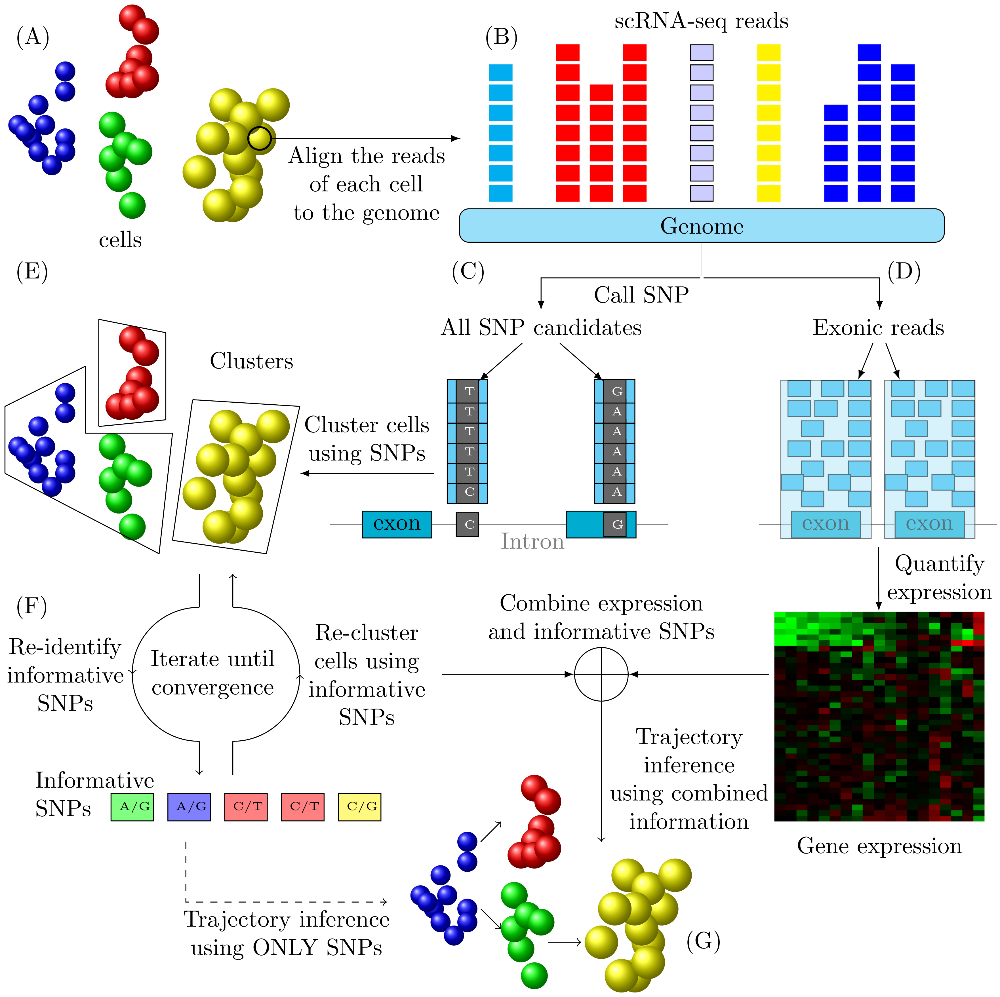
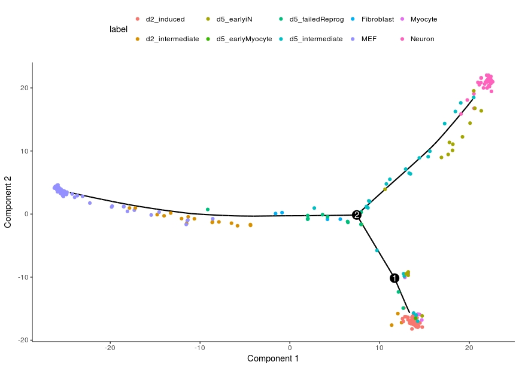
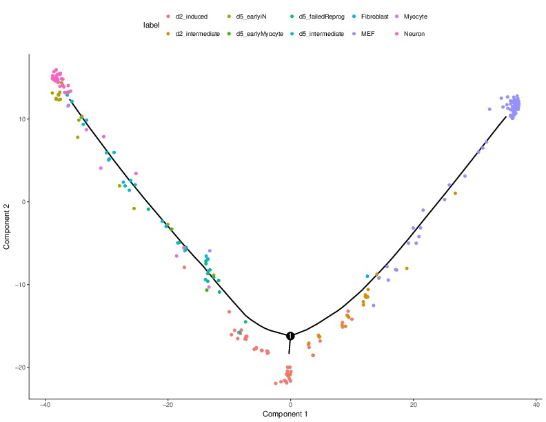

 TBSP: **T**rajectory Inference **B**ased on **S**N**P** information.  
[](https://opensource.org/licenses/MIT)      


# Table of Contents
1. [INTRODUCTION](#introduction)
2. [PREREQUISITES](#prerequisites)
3. [INSTALLATION](#installation)
4. [USAGE](#usage)
5. [INPUTS AND PRE-PROCESSINGS](#inputs-and-pre-processings)
6. [OUTPUTS](#outputs)
7. [EXAMPLES](#examples)
8. [INTEGRATION WITH EXISTING METHODS](#integration-with-existing-methods)


# INTRODUCTION 
<div style="text-align: justify"> 
Several recent studies focus on the inference of developmental and response trajectories from single cell RNA-Seq (scRNA-Seq) data. A number of computational methods, 
often referred to as pseudo-time ordering, have been developed for this task. 
Recently, CRISPR has also been used to reconstruct lineage trees by inserting random mutations. 
However, both approaches suffer from drawbacks that limit their use. Here we develop a method to detect significant, cell type specific, 
sequence mutations from scRNA-Seq data. We show that only a few mutations are enough for reconstructing good branching models. 
Integrating these mutations with expression data further improves the accuracy of the reconstructed models. 

</div>  



# PREREQUISITES

* python (python 2 and python 3 are both supported)  
It was installed by default for most Linux distribution and MAC.  
If not, please check [https://www.python.org/downloads/](https://www.python.org/downloads/) for installation 
instructions. 

* Python packages dependencies:  
-- scikit-learn   
-- scipy  
-- numpy  
-- matplotlib    
-- networkx   
-- pyBigWig  
-- Biopython  


* other dependencies:   
-- python-dev (python2) or python3-dev (python3)  
It can be installed easily for most linux distributions. For example, debian/ubuntu:
	```
	sudo apt-get install python-dev
	or 
	sudo apt-get install python3-dev
	```
	For Macos, it was installed by default. 
	The python setup.py script (or pip) will try to install these packages automatically.
	However, please install them manually if, by any reason, the automatic 
	installation fails. 

* Platform:  
Macos and Linux verified. For windows, the dependent pyBigWig package is not available.   
However, the Docker version of TBSP is available for all platforms.  

# INSTALLATION
 
 There are 4 options to install tbsp.  
* __Option 1: setup.py script installation from download directory__   
	cd to the downloaded scdiff package root directory

	```shell
	$cd tbsp
	```
	run python setup to install   

	```shell
	$python setup.py install
	```
		
	MacOS or Linux users might need the sudo/root access to install. 
	Users without the root access can install the package using the pip/easy_install with a --user parameter ([install python libraries without root](https://stackoverflow.com/questions/7465445/how-to-install-python-modules-without-root-access))．
	 
	```shell  
	$sudo python setup.py install 
	```
	use python3 instead of python in the above commands to install if using python3. 
	
* __Option 2: pip installation from Github__:    

	python 2:  
	```shell
	$sudo pip install  --trusted-host github.com --upgrade http://github.com/phoenixding/tbsp/zipball/master
	```
	python 3: 
	```shell
	$sudo pip3 install --trusted-host github.com --upgrade http://github.com/phoenixding/tbsp/zipball/master
	```
	
* __Option 3: pip installation from PyPI__:   
	
	python 2:  
	```shell
	$sudo pip install  --trusted-host pypi.org --trusted-host files.pythonhosted.org --upgrade tbsp
	```
	python 3: 
	```shell
	$sudo pip3 install  --trusted-host pypi.org --trusted-host files.pythonhosted.org --upgrade tbsp
	```
	
	The above pip installation options should be working for Linux and MacOS systems.   
	For MacOS users, it's recommended to use python3 installation. The default python2 in MacOS has
	some compatibility issues with a few dependent libraries. The users would have to install their own
	version of python2 (e.g. via [Anocanda](https://anaconda.org/)) if they prefer to use python2 in MacOS.    
	
* __Option 4: Installation as Docker images__ (Most robust way, no dependencies on all platforms)  
	Users would need to install Docker to run the tbsp image. Please refer to [Docker installation page](https://docs.docker.com/install/) for detailed installation instructions. 
	
	To install tbsp image:    
	
	```
	$sudo docker pull johnding1986/tbsp 
	```
	To run tbsp image :
	
	```
	$sudo docker run -v /PATH_TO_FILE_DIRECTORY:/tbsp  johnding1986/tbsp 
	```
	Users would need to use the -v command to mount local directories. 
	
	
# USAGE

```shell
usage: tbsp.py [-h] -i IVCF [-b [IBW]] [-k KCLUSTER] [-l [CELL_LABEL]] -o
               OUTPUT [--cutl CUTL] [--cuth CUTH] [--greedycut GREEDYCUT]
               [--cutc CUTC] [--maxiter MAXITER]

optional arguments:
  -h, --help            show this help message and exit
  -i IVCF, --ivcf IVCF  Required,directory with all input .vcf files. This
                        specifies the directory of SNP files (.vcf) for the
                        cells (one .vcf file for each cell). These .vcf files
                        can be obtained using the provided bam2vcf script or
                        other RNA-seq variant calling pipelines preferred by
                        the users.
  -b [IBW], --ibw [IBW]
                        Optional,directory with all input bigwig (.bw) files
                        with the information about the number of aligned reads
                        at each genomic position. These bigwig files are used
                        to filter the SNPs, which are redundant to expression
                        information.
  -k KCLUSTER, --kcluster KCLUSTER
                        Optional, number of clusters, Integer. If not
                        specified, the program will choose the k with best
                        silhouette score.
  -l [CELL_LABEL], --cell_label [CELL_LABEL]
                        Optional, labels for the cells. This is used only to
                        annotate the cells with known information, not used
                        for building the model.
  -o OUTPUT, --output OUTPUT
                        Required,output directory
  --cutl CUTL           Optional, lower bound cutoff to remove potential false
                        positive SNPs, default=0.1
  --cuth CUTH           Optional, upper bound cutoff to remove baseline SNPs,
                        which are common in most cells, default=0.8
  --greedycut GREEDYCUT
                        Optional, the stopping cutoff for the greedy search of
                        candidate SNPs, default=0.05 (less than 0.05 score
                        improvement). A larger cutoff means less strict SNP
                        candidate search
  --cutc CUTC           Optional, convergence cutoff, a smaller cutoff
                        represents a stricter convergence
                        criterion,default=0.001
  --maxiter MAXITER     Optional, the maximal number of iterations allowed
                                             
```

# INPUTS AND PRE-PROCESSINGS


* __-i__:    
Required input, this specifies the directory of all SNP(.vcf) files. We recommend using [GATK RNA-seq variant calling pipeline](https://software.broadinstitute.org/gatk/documentation/article.php?id=3891) to call the vcfs from .bam (mapped reads) files. 
Users are also allowed to use the SNPs (.vcfs) identified by programs of their preferences (e.g. freebayes).  
We also provied a GATK based SNP calling script (bam2vcf.py) at [bam2vcf](https://my.pcloud.com/publink/show?code=XZsOrK7Z73GL0GzatDf1VGxYimgQXH0cmC0V), which automates the SNP calling procedure from .bam files to .vcf files. 
Please use "python bam2vcf.py --help" to see the script usage. 


* __-b__:  
Optional input, this specifies the directory of all bigwig (.bw) files. We provided the script [bam2bw.py](./bam2bw/bam2bw.py) under [bam2bw](./bam2bw) directory to convert the bam files to bigwig files. This files are
used to filter SNPs, potentially redundant to expression. 

* __-l__:  
Optional input, this specifies the labels for the cells. 
File format (tab-delimited):  
```
cell1	label1
cell2	label2
```
These cell labels are only used to annotate the cells in the trajectory.
The other optional parameters are specified above.

# OUTPUTS


* __GroupCells.txt__:  
A text file, which describes the cells in each cluster.

	Format:
	```
	Cell_ID	Cluster_ID
	SRR1931024	cluter:0
	SRR1930999	cluter:0
	SRR1930977	cluter:0
	SRR1931041	cluter:0
	SRR1931012	cluter:0
	SRR1930945	cluter:0
	SRR1931003	cluter:0
	SRR1931002	cluter:0
	SRR1931004	cluter:0
	..
	```

* __SNP_matrix.tsv__:   
The SNP matrix for all the cells. 
Row: SNPs
Column: Cells
Value: Binary (0/1), which indicates whther the SNP is included in the cell.
 
	```
	SNP	SRR1931024	SRR1930999	SRR1930977	SRR1931041	SRR1931012	SRR1930945	SRR1931003	SRR1931002	SRR1931004	SRR1931009	SRR1931031	SRR1930994	SRR1930995	SRR1930992
	chr18,31438715	0	0	0	0	0	0	0	0	0	0	0	0	0	0
	chr13,99421798	0	0	0	0	0	0	0	0	0	0	0	0	0	0
	chr18,48047497	0	0	0	0	0	0	0	0	0	0	0	0	0	0
	chr1,98777608	0	1	1	1	0	1	1	0	0	0	0	0	1	0
	chr12,75631154	0	0	0	0	0	0	0	0	0	0	0	0	0	0
	chr2,80837890	0	0	0	0	0	0	0	0	0	0	0	0	0	0
	chr10,56497362	1	0	0	1	0	1	1	0	1	1	0	0	1	0
	chr9,42254324	0	0	0	0	0	0	0	0	0	0	1	0	1	0
	chr10,56497777	0	0	0	0	0	0	1	1	0	1	0	0	0	1
	chr9,42254361	0	0	0	0	0	0	0	0	0	0	1	0	1	0
	chr18,28188943	0	1	1	1	1	1	1	1	0	0	1	1	0	1
	chr14,46775753	1	0	0	1	0	1	0	1	0	1	1	0	1	1
	chr4,141015053	0	0	0	1	0	0	0	0	0	0	0	0	0	0
	chr6,3201327	0	0	1	0	0	0	1	1	1	0	0	0	0	0
	chr2,152737258	0	1	0	0	1	0	1	1	0	1	1	0	1	0
	chr4,150417174	1	0	0	0	1	0	1	0	1	0	0	1	0	0
	chr6,136872487	0	1	1	1	0	0	1	1	0	0	1	0	0	0
	chr8,41341106	1	1	1	0	1	1	1	1	1	0	1	1	0	1
	chr17,72849135	1	1	1	1	0	0	1	1	1	1	1	1	1	1
	chr17,6132279	0	0	0	0	0	0	0	0	0	0	0	0	0	0
	chr8,102864840	0	0	0	0	0	0	0	0	0	0	0	0	0	0
	chr13,74406968	1	1	1	1	0	1	1	1	1	1	1	0	1	1
	chr11,45829261	0	1	1	0	0	1	1	0	0	1	0	0	0	0
	chr8,54522180	0	1	1	0	0	1	0	0	0	0	0	0	0	0
	chr9,67023057	0	1	1	0	1	1	0	1	0	0	1	1	1	1
	chr10,128076602	1	1	1	1	1	0	1	1	1	1	1	1	1	1
	chr6,4540674	0	1	1	1	1	1	1	0	1	1	1	0	1	1
	chr17,70996716	1	1	1	1	0	1	1	1	1	1	1	1	1	1
	chr5,115345677	0	1	1	1	1	1	0	1	0	0	0	1	1	1
	chr2,136782052	0	0	0	0	0	0	0	0	0	0	0	0	0	0

	```


* __SNP_matrix.jpg__:   
The SNP matrix in jpg image. 

* __Trajectory.dat__:    

	```
	4	(-0.6168642633606496, -0.29504774213348317)
	Inner4	(-0.01784069226314263, -0.19237987266625067)
	2	(-1.0, 0.1907479586411944)
	Inner5	(0.526511663382742, -0.048432121394020027)
	6	(0.6167190582080249, -0.21090119687699874)
	0	(-0.02807716265846153, -0.3564777531262085)
	3	(-0.7661682030072015, 0.29873283057457906)
	Inner3	(-0.4986251141938113, -0.13657170781011707)
	Inner1	(0.785885623794461, 0.14046537917538365)
	5	(0.8477737598817315, 0.3307492805568145)
	1	(0.9509945159224894, 0.1308847244003101)
	Inner2	(-0.8003091857061821, 0.14823022065879607)
	```
	First column: cluster id  
	second column: coordinates  
	TBSP trajectories were presented in the form of uprooted phylogenetic tree structure.
	The coordinates for each node(cluster) are given by the above Trajectory.dat result. 
	With the coordinates, users can able to compute the length for each of the branches in the tree.
	User can setup a user-defined distance cutoff to find out major divergence events. An example cutoff can be set 
	as top 25% of all branch lengths.  
	
* __Trajectory.jpg__:     
Graph representation of Trajectory.dat 


# INTEGRATION WITH EXISTING METHODS  
TBSP model provides a SNP MATRIX, which presents the SNP signature vector for each of the cells in the dataset.
As we show in the paper, such SNP MATRIX is very informative for trajectory inference.
The cell trajectories can be improved by integrating SNP matrix with expression data. 

There are many ways to utilize the SNP matrix information, here we used a simple example to demonstrate the integration.  

MONOCLE 2 is used widely for trajectory inference and has very good performance.  However, it's based on only single-cell expression 
data and thus may be limited in many scenarios.  

For example, the following is the Monocle 2 results on a 2016 neuron reprogramming single-cell dataset (https://www.ncbi.nlm.nih.gov/pubmed/27281220)
. The processed expression data can be found in the [integration_example](integration_example/neuron_original.tsv) directory. 

(1) In the above results, we observe that d2_induced cells are in a separate branch in the bottom right while the neuron cells are on the branch at top right,
which contradicts the findings in the original study (Trajectory: MEF->d2_intermediate-> d2_induced-> d5_intermeidate-> d5_earlyiN->Neuron), in which the d2_induced cells are serving as the progenitors to the neuron cells.  
(2) Running TBSP on the same dataset, we have obtained 36 SNPs as shown in [integration_example/SNP_matrix.tsv](integration_example/SNP_matrix.tsv).  
(3) Combine the expression features and SNP features.  There are multiple ways to combine these two types of information. 
In the paper, we have discussed the strategy of refining the cell assignment in the expression-based trajectories using SNP information. 
To be more specific, we integrate the SNP information to re-calculate the likelihood when re-assigning the cells to the trajectories. 
Here, we discuss the most naive way to integrate SNP features with expression features: Merge the  features directly. 
For each cell, we put together the expression features (gene expression levels associated with cell) and SNP features (Binary SNP features 0/1 associated with the cell). 

```
expression:
cell	gene1	gene2	gene3 ...
c1	1.6	2.4	3.8 ...
c2	2.8	4.8	6.4	...

+snp:
cell snp1	snp2	snp3
c1	1	0	1	...
c2	0	1	0	...

=>combined:
combined_info	gene1	gene2	gene3	snp1	snp2	snp3	...
c1	1.6	2.4	3.8	1	0	1	...
c2	2.8	4.8	6.5	0	1	0	...

```

Please note that number of the SNP features (usually in the range of 30-100) is much smaller than the number of genes (expression features).
Therefore, to put more weights on the SNP features, we need to over-sample the SNP features.  In the above example, we oversampled the SNPs for 100 times (=> 3600 SNP features). 
The combined dataset for the above example can be found in the [integration_example](integration_example/neuron_combined.tsv) directory. 
 

(4) Run Monocle on the SNP-integrated dataset. 


The above SNP-integrated Monocle results on the neuron reprogramming dataset perfectly matches the findings in the original study (MEF->d2_intermediate-> d2_induced-> d5_intermeidate-> d5_earlyiN->Neuron).
d2_induced cells nows are the progenitors of the neuron cells. Also, d5 cells are coming later than d2 cells. 
Even using very simple integration strategy as shown above, the cell trajectories can be significantly improved. 

# EXAMPLES
* __Direct Run__:  
	* __Example inputs__:  
	We provided example vcf files under [examples](./examples/vcf_example) folder. 
	To run tbsp on the example data:
	```
	$tbsp -i examples/vcf_example -o example_out
	```

	* __Example outputs__:  
	Example output files can be found under [examples](./examples/output_example) folder.

* __Docker Run__:  
	We provided example vcf files under [examples](./examples/vcf_example) folder. 
	To run docker tbsp on the example data:
	
	```
	$sudo docker run -v ~/Download/examples:/tbsp  johnding1986/tbsp -i /tbsp/vcf_example -o /tbsp/example_out 
	```
	where ~/Download/examples  should be replaced by the parent directory of the folder of vcf files.  The result files 
	are the same as described above.  
	
# CREDITS
 
This software was developed by ZIV-system biology group @ Carnegie Mellon University.  
Implemented by Jun Ding.


# LICENSE 
 
This software is under MIT license.  


# CONTACT

zivbj at cs.cmu.edu  
jund  at cs.cmu.edu


                                 
                                 
                                 
                                 
                                 

                                                     
